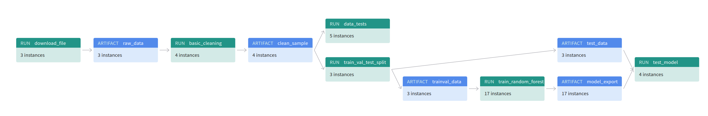

# Build an ML Pipeline for Short-Term Rental Prices in NYC
You are working for a property management company renting rooms and properties for short periods of 
time on various rental platforms. You need to estimate the typical price for a given property based 
on the price of similar properties. Your company receives new data in bulk every week. The model needs 
to be retrained with the same cadence, necessitating an end-to-end pipeline that can be reused.

## Table of contents

- [Introduction](#build-an-ML-Pipeline-for-Short-Term-Rental-Prices-in-NYC)
- [Preliminary steps](#preliminary-steps)
  * [Create environment](#create-environment)
  * [Get API key for Weights and Biases](#get-api-key-for-weights-and-biases)
  * [The configuration](#the-configuration)
  * [Running the entire pipeline or just a selection of steps](#Running-the-entire-pipeline-or-just-a-selection-of-steps)
  * [Pre-existing components](#pre-existing-components)
- [Instructions](#instructions)
  * [Exploratory Data Analysis (EDA)](#exploratory-data-analysis-eda)
  * [Data cleaning](#data-cleaning)
  * [Data testing](#data-testing)
  * [Data splitting](#data-splitting)
  * [Training Random Forest](#training-random-forest)
  * [Optimizing hyperparameters](#optimizing-hyperparameters)
  * [Selecting and tagging the best model](#selecting-and-tagging-the-best-model)
  * [Testing](#testing)
  * [Visualize the pipeline](#visualize-the-pipeline)
- [License](#license)

## Preliminary steps
### Create environment
Make sure to have conda installed and ready, then create a new environment using the ``environment.yml``
file provided in the root of the repository and activate it:

```bash
conda env create -f environment.yml
conda activate nyc_airbnb_dev
```

### Get API key for Weights and Biases
Let's make sure we are logged in to Weights & Biases. Get your API key from W&B by going to 
[https://wandb.ai/authorize](https://wandb.ai/authorize) and click on the + icon (copy to clipboard), 
then paste your key into this command:

```bash
wandb login [your API key]
```

You should see a message similar to:
```
wandb: Appending key for api.wandb.ai to your netrc file: /home/[your username]/.netrc
```

### The configuration
As usual, the parameters controlling the pipeline are defined in the ``config.yaml`` file defined in
the root of the starter kit. We will use Hydra to manage this configuration file. 

### Running the entire pipeline or just a selection of steps
In order to run the pipeline, you need to be in the root of the starter kit, 
then you can execute as usual:

```bash
mlflow run .
```
This will run the entire pipeline.

Say you want to run only the ``download`` step. The `main.py` is written so that the steps are defined at the top of the file, in the 
``_steps`` list, and can be selected by using the `steps` parameter on the command line:

```bash
mlflow run . -P steps=download
```
If you want to run the ``download`` and the ``basic_cleaning`` steps, you can similarly do:
```bash
mlflow run . -P steps=download,basic_cleaning
```
You can override any other parameter in the configuration file using the Hydra syntax, by
providing it as a ``hydra_options`` parameter. For example, say that we want to set the parameter
modeling -> random_forest -> n_estimators to 10 and basic_cleaning -> etl -> min_price to 50:

```bash
> mlflow run . \
  -P steps=download,basic_cleaning \
  -P hydra_options="modeling.random_forest.n_estimators=10 basic_cleaning.etl.min_price=50"
```

### Pre-existing components
Some pre-implemented re-usable components are defined in `components` folder. One can be using them from the original
repository by accessing them through their GitHub link, like:

```python
_ = mlflow.run(
                f"{config['main']['components_repository']}/get_data",
                "main",
                parameters={
                    "sample": config["etl"]["sample"],
                    "artifact_name": "sample.csv",
                    "artifact_type": "raw_data",
                    "artifact_description": "Raw file as downloaded"
                },
            )
```
where `config['main']['components_repository']` is set to 
[https://github.com/udacity/build-ml-pipeline-for-short-term-rental-prices#components](https://github.com/udacity/build-ml-pipeline-for-short-term-rental-prices/tree/main/components).
You can see the parameters that they require by looking into their `MLproject` file:

- `get_data`: downloads the data. [MLproject](https://github.com/udacity/build-ml-pipeline-for-short-term-rental-prices/blob/main/components/get_data/MLproject)
- `train_val_test_split`: segregate the data (splits the data) [MLproject](https://github.com/udacity/build-ml-pipeline-for-short-term-rental-prices/blob/main/components/train_val_test_split/MLproject)
- `test_regression_model`: this step takes the best model, tagged with the __prod__ tag, and tests it against the test dataset. [MLproject](https://github.com/udacity/build-ml-pipeline-for-short-term-rental-prices/blob/main/components/test_regression_model/MLproject)

In this project, these components were downloaded and used locally with some minor modifications.

__NOTE In case of errors__
When you make an error writing your `conda.yml` file, you might end up with an environment for the pipeline or one
of the components that is corrupted. Most of the time `mlflow` realizes that and creates a new one every time you try
to fix the problem. However, sometimes this does not happen, especially if the problem was in the `pip` dependencies.
In that case, you might want to clean up all conda environments created by `mlflow` and try again. In order to do so,
you can get a list of the environments you are about to remove by executing:

```bash
conda info --envs | grep mlflow | cut -f1 -d" "
```

If you are ok with that list, execute this command to clean them up:

**_NOTE_**: this will remove *ALL* the environments with a name starting with `mlflow`. Use at your own risk

```bash
for e in $(conda info --envs | grep mlflow | cut -f1 -d" "); do conda uninstall --name $e --all -y;done
```

This will iterate over all the environments created by `mlflow` and remove them.

## Instructions
### Exploratory Data Analysis (EDA)
Run the `download` component to get a sample of the data. The pipeline will also upload it to Weights & Biases:
   
```bash
mlflow run . -P steps=download
```
  
Now execute the `eda` step:
```bash
mlflow run src/eda
```
This will install Jupyter and all the dependencies for `pandas-profiling`, and open a Jupyter notebook EDA instance.

### Data cleaning
   
Run the pipeline. If you go to W&B, you will see the new artifact type `clean_sample` and within it the `clean_sample.csv` artifact

### Data testing

After the cleaning, it is a good practice to put some tests that verify that the data does not
contain surprises. 

Run the pipeline and make sure the tests are executed and that they pass. Remember that you can run just this
step with:

```bash
mlflow run . -P steps="data_check"
```

### Data splitting
Use the provided component called ``train_val_test_split`` to extract and segregate the test set. 
Add it to the pipeline then run the pipeline. As usual, use the configuration for the parameters like `test_size`,
`random_seed` and `stratify_by`.

### Training Random Forest

The component for training Random Forest model is defined at `src/train_random_forest` folder.

### Optimizing hyperparameters
Re-run the entire pipeline varying the hyperparameters of the Random Forest model. This can be
accomplished easily by exploiting the Hydra configuration system like so:

```bash
mlflow run . \
    -P steps=train_random_forest \
    -P hydra_options="modeling.max_tfidf_features=10,15,30 modeling.random_forest.max_features=0.1,0.33,0.5,0.75,1 -m"
```
you can change this command line to accomplish your task.

### Selecting and tagging the best model

The best model with best score is tagged under `prod` tag in [WANDB project link](https://wandb.ai/biddyasdiddy/udacity-mldevops-2nd-project-final).

### Testing
``test_regression_model`` component tests your production model against the test set.

**NOTE**: This step is NOT run by default when you run the pipeline. In fact, it needs the manual step
of promoting a model to ``prod`` before it can complete successfully. Therefore, you have to
activate it explicitly on the command line:

```bash
mlflow run . -P steps=test_regression_model
```

### Visualize the pipeline
Go to W&B, go the Artifacts section, select the model export artifact then click on the
``Graph view`` tab. You will see a representation of the pipeline.


## License

[License](LICENSE.txt)
